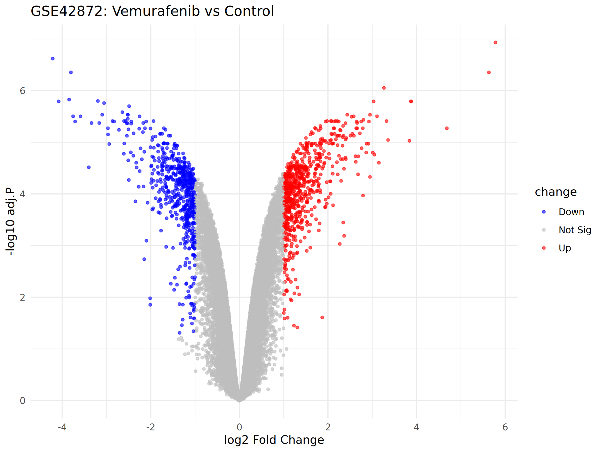

# GSE42872 Differential Expression Analysis

Differential expression analysis of GSE42872 (A375 melanoma cells treated with Vemurafenib vs Control) using R and limma.

## Dataset

- **GEO accession**: [GSE42872](https://www.ncbi.nlm.nih.gov/geo/query/acc.cgi?acc=GSE42872)
- **Platform**: Affymetrix Human Genome U133 Plus 2.0 Array
- **Samples**: 6 (3 Control, 3 Vemurafenib)
- **Organism**: Homo sapiens

## Methods

1. Data downloaded with `GEOquery`
2. Differential expression analyzed with `limma`
3. Genes with `adj.P.Val < 0.05` and `|logFC| > 1` considered significant
4. Volcano plot generated with `ggplot2`

## Project Structure

    bioinfo_project/
    ├── data/          # Raw and processed data
    ├── scripts/       # Analysis scripts
    │   └── 01_differential_expression.R
    ├── results/       # Differential expression results
    │   └── deg_results.csv
    └── figures/       # Plots
        └── volcano.png

## How to Reproduce

    Rscript scripts/01_differential_expression.R

## Results

The volcano plot shows genes significantly up- or down-regulated after Vemurafenib treatment:

## Author

- GitHub: [@Lisir-05](https://github.com/Lisir-05)

